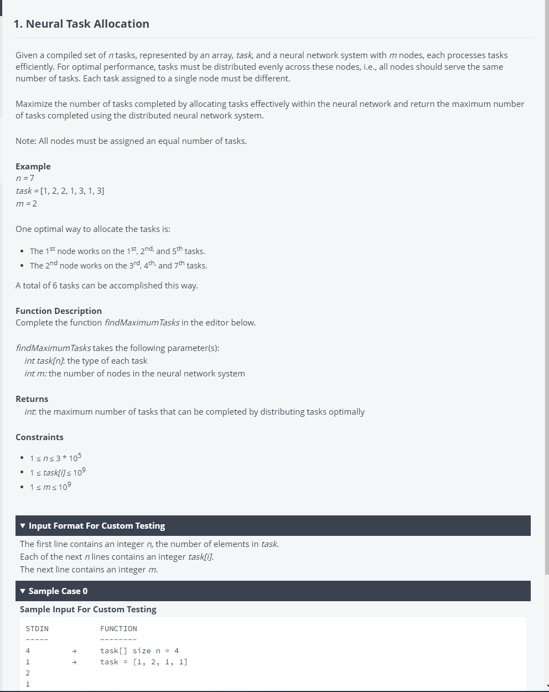
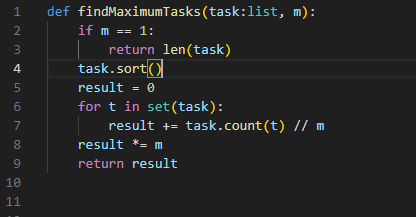
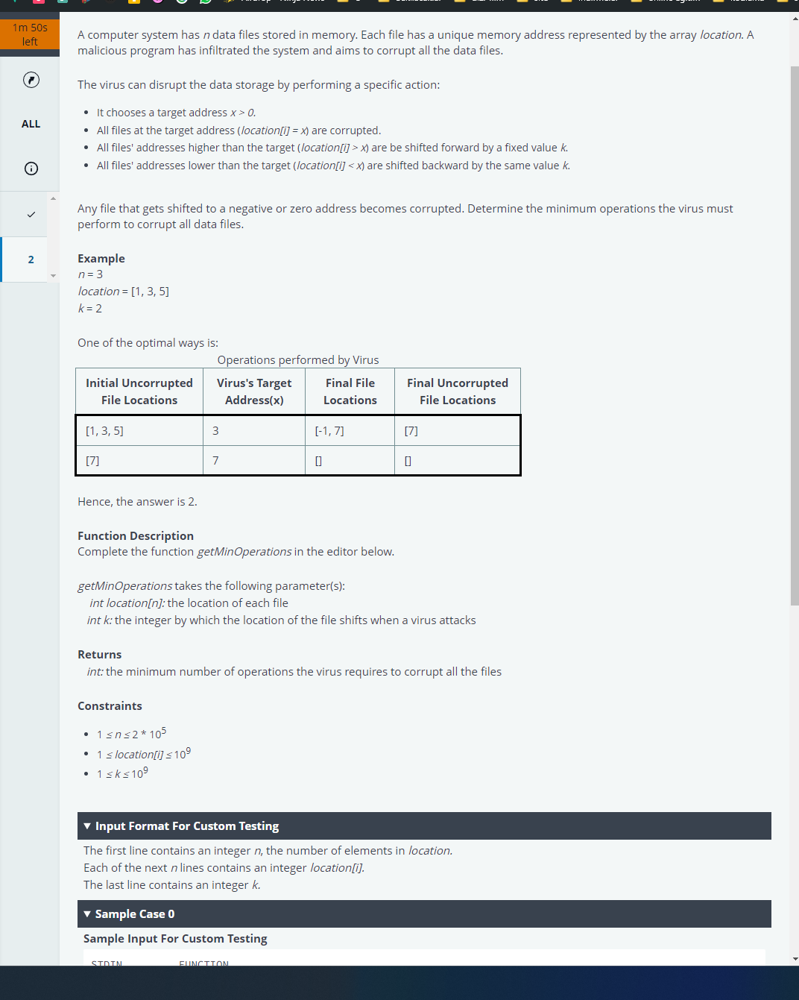
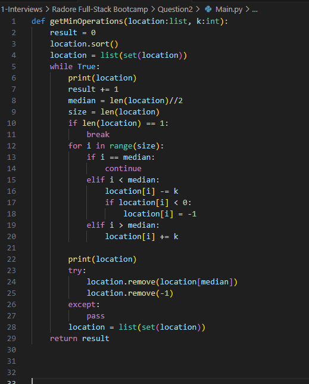

bu soruda hızlıca bu kodu yazdım fakat kabul etmedi. Yanlış anlamadıysam. Task içindeki sayıları aynı elemanlara sahip olacak şekilde m kadar kısma bölmek. Yani örnekte verilen; 

`1,2,2,1,3,1,3` => sıralanır ve => `1,1,1,2,2,3,3` olur  

sonra her sayının sayısı kadar yani 1 den 3 adet var 3//2 = 1 denir. `kalan önemli değil`. sonra bunlar toplanır.burada `3//2 = 1` soncuu ile her m düğümünde 1 adet 1 olacak demiş olduk. Bu sonuç 2 ve 3 içinde aynı olacğından her düğüm `1,2,3` şeklinde olacak. 2 düğüm ve bu düğümlerde 3 er eleman var yani 3*2 = 6 ile sonuç bulunacak. Fakat kodda bunu yaptığımda saçma hatalar aldım. Ya kodum yanlış yada soruyu yanlış anladım ama şuan bile doğru anladığımı düşünüyorum. İngilizce önemli.

 

sıralama işlemi gereksizmiş bu arad şuan fark ettim. 

 
 

 
 
 

bu kodu şuan düşündüm test edemiyorum ben k değerini test sırası unuttum malesef ve k yerine median değerini kullanarak ekleme çıkartma yaptım soru örneğindeki ile bnaşarılı oldu bu kod test sırası normalde yapmam fakat absürt örnek üzerinden basit sordukları için elim ayağım dolandı birde ingilizce olunca kavramam zor oluyor. tabiki bunlar benim hatam orası ayrı. birilerinin içine yarar belki